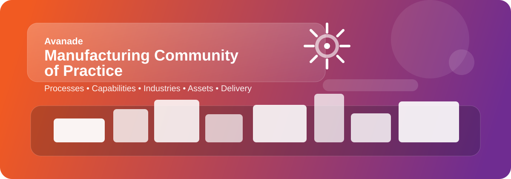
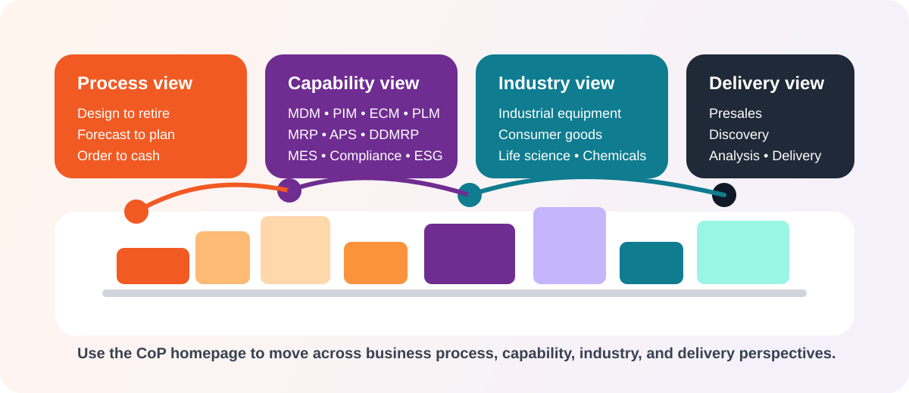

# Avanade Manufacturing Community of Practice

  

Welcome to the **Avanade Manufacturing Community of Practice (CoP)** resource hub. This introduction homepage gives CoP members a fast way to explore manufacturing knowledge from multiple perspectives, including end-to-end processes, production principles, capabilities, industries, assets, ISV solutions, and project lifecycle activities.

This homepage is designed to help teams quickly find related information for strategy, solutioning, and delivery conversations. It also complements the existing **project management** documentation already present in this repository so members can move from manufacturing context into execution guidance without losing momentum.

## Quick navigation

- [End-to-end Processes for Manufacturers](#a-end-to-end-processes-for-manufacturers)
- [Production principles](#b-production-principles)
- [Capabilities](#c-capabilities)
- [Industries](#d-industries)
- [Avanade Assets](#e-avanade-assets)
- [ISV solutions](#f-isv-solutions)
- [Project lifecycle](#g-project-lifecycle)
- [Related repository resources](#related-repository-resources)

  

## How to use this homepage

Use this page as a starting point when you want to:

- understand the manufacturing value chain from business and operational viewpoints
- connect production strategies to the right enabling capabilities
- map industry context to Avanade assets and partner solutions
- find related delivery guidance and repository resources for project execution

---

## A. End-to-end Processes for Manufacturers

These processes help CoP members frame manufacturing transformation work across the full operational lifecycle:

| Process | Focus |
| --- | --- |
| **Design to retire** | Manage the lifecycle of products and assets from engineering through retirement. |
| **Acquire to dispose** | Govern sourcing, procurement, usage, and retirement of equipment, tools, and materials. |
| **Forecast to plan** | Translate demand signals into planning assumptions for supply, capacity, and operations. |
| **Plan to produce** | Convert plans into executable production schedules, material requirements, and shop-floor activity. |
| **Order to cash** | Connect customer demand, fulfillment, invoicing, and revenue realization. |
| **Inventory to deliver** | Balance stock, warehousing, logistics, and service levels across the supply network. |
| **Service to deliver** | Support installed products and customer outcomes with service execution and feedback loops. |

## B. Production principles

These production models shape planning, manufacturing execution, and customer fulfillment:

| Principle | Typical use |
| --- | --- |
| **Make to Stock** | Produce against forecast for high-volume, repeatable demand patterns. |
| **Make to Order** | Start production after order confirmation to limit finished-goods inventory. |
| **Configure to Order** | Assemble configurable variants using predefined options and modular structures. |
| **Engineer to Order** | Design and manufacture highly tailored products based on unique customer requirements. |

## C. Capabilities

This view describes manufacturing from a capability perspective so members can identify the building blocks required for transformation:

### Product, engineering, and master data

- **Master data management (MDM)**
- **Product information management (PIM)**
- **Engineering change management (ECM)**
- **Product lifecycle management (PLM)**

### Planning and optimization

- **Demand planning**
- **Production planning and scheduling**
- **MRP**
- **APS**
- **DDMRP**

### Execution and control

- **Production control**
- **Shop-Floor control**
- **MES (Manufacturing Execution)**
- **Production materials management**

### Financial, regulatory, and ESG

- **Production cost control**
- **Compliance**
- **Sustainability**

## D. Industries

The Manufacturing CoP supports industry-specific scenarios and solution patterns across a broad market landscape:

### Industrial equipment

- Industrial components
- Machine manufacturing
- Plant engineering
- Car and vehicle manufacturing
- Automotive supplier

### Consumer goods

- Food and drink
- Electronic devices
- Furniture
- Apparel and footwear
- Luxury
- Household articles
- Other

### Additional sectors

- Life science
- Chemicals
- Construction

## E. Avanade Assets

Avanade accelerators that can support manufacturing solutioning and delivery:

- **Production foundation**
- **Universal class characteristics**
- **External production**
- **Factory OS**
- **Advanced product calculation**

## F. ISV solutions

Key Independent Software Vendor (ISV) solution areas commonly used in manufacturing programs:

- **PLM**
- **APS**
- **MES**
- **CPQ**

## G. Project lifecycle

This perspective helps members align manufacturing opportunities with delivery stages:

| Lifecycle stage | Typical CoP contribution |
| --- | --- |
| **Presales** | Shape client conversations, qualification, and value propositions. |
| **Envision / Discovery** | Define business goals, operating model priorities, and target-solution scope. |
| **Analysis** | Detail requirements, process design, capability gaps, and architecture decisions. |
| **Delivery** | Implement, validate, deploy, and continuously improve manufacturing solutions. |

## Related repository resources

The repository already includes supporting project management resources that teams can use alongside this Manufacturing CoP homepage:

- [octoacme-execution-and-tracking.md](./octoacme-execution-and-tracking.md)
- [octoacme-project-initiation.md](./octoacme-project-initiation.md)
- [octoacme-project-management-overview.md](./octoacme-project-management-overview.md)
- [octoacme-project-planning.md](./octoacme-project-planning.md)
- [octoacme-release-and-deployment.md](./octoacme-release-and-deployment.md)
- [octoacme-retrospective-and-continuous-improvement.md](./octoacme-retrospective-and-continuous-improvement.md)
- [octoacme-risks-and-communication.md](./octoacme-risks-and-communication.md)
- [octoacme-roles-and-personas.md](./octoacme-roles-and-personas.md)

Together, these resources help CoP members move from manufacturing strategy and solution design into structured delivery, governance, and continuous improvement.
